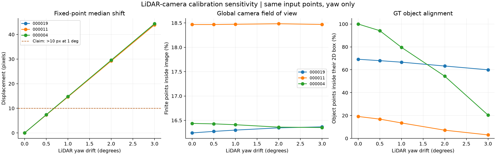
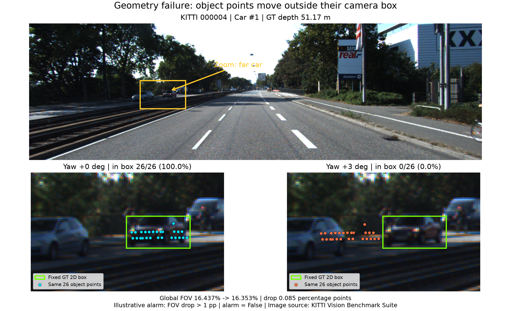

# Báo cáo Day 6: Độ nhạy của phép chiếu LiDAR-camera với lệch yaw

> Hoàn thành code, thí nghiệm và báo cáo CP1–CP5 tại máy; chuẩn bị CP6 trong `report/DEMO.md`. Kiểm tra nộp bài đạt toàn bộ PASS. Không push theo yêu cầu của chủ repo; chưa nộp LMS và chưa thực hiện trình bày trước lớp.

- **Họ tên:** Nguyễn Văn Tứ
- **MSSV:** 2A202602586
- **Lớp:** AI20K-H209
- **Link repo:** https://github.com/nguyenvantu19/NguyenVanTu-2A202602586-Track4-Day21
- **Topic:** A — Kiểm tra calibration LiDAR-camera bằng projection (LiDAR-camera projection QA), mục tiêu mức Good; chạy CPU, không cần detector.
- **Dataset:** `data/synthetic` để debug; `data/kitti_mini` cho thí nghiệm chính. Nguồn dữ liệu thật: KITTI Vision Benchmark Suite.
- **Các frame đã dùng:** synthetic `000000`–`000004` (data health), `000000` (overlay); KITTI `000019`, `000011`, `000004` (benchmark/overlay); nuScenes `scene-0103_010` (kiểm tra overlay). Data health kiểm tra cả 20 frame KITTI và 80 frame nuScenes; claim chỉ đánh giá trên 3 frame KITTI.
- **Vai trò frame KITTI:** `000019` có Truck gần (z_cam = 5,46 m); `000011` có Car ở 26,64 m và nhiều Pedestrian; `000004` có Car xa ở 51,17 m. Các khoảng cách này là độ sâu tâm đáy box theo label, không phải khoảng cách Euclid.

## 1. Claim

**Claim:** Trên từng frame KITTI `000019`, `000011`, `000004`, khi chỉ làm lệch yaw của extrinsic LiDAR-camera +1° quanh trục z của LiDAR, trung vị độ dịch chuyển pixel của cùng tập điểm LiDAR so với calibration gốc lớn hơn 10 pixel.

**Kết quả CP3:** Claim được số liệu hỗ trợ trên cả 3 frame: trung vị tại +1° lần lượt 14,728 / 14,601 / 14,778 px. Đây là độ nhạy so với calibration gốc, chưa phải sai số so với correspondence pixel ground truth độc lập.

- **Phép đo:** `d_i = sqrt((u_i(yaw) - u_i(0))² + (v_i(yaw) - v_i(0))²)`; báo `median(d_i)` theo từng frame, so ngưỡng 10 px ở +1°; chỉ cần một frame không vượt ngưỡng là claim bị bác bỏ.
- **Tập điểm cố định:** điểm có cả 4 giá trị hữu hạn, khoảng cách Euclid XYZ 3–80 m, z_cam > 0,1 m và nằm trong ảnh ở baseline 0°. Giữ nguyên ID điểm qua mọi mức; điểm ra ngoài ảnh sau perturb vẫn tính độ dịch chuyển nếu phép chiếu hữu hạn và depth dương; báo riêng số điểm không chiếu được.
- **Các mức thay đổi:** yaw `0°, +0,5°, +1°, +2°, +3°` bằng `perturb_extrinsic`; giữ pitch, roll và translation bằng 0, giữ nguyên ảnh, P2, R0_rect, point cloud và bộ lọc. Không lấy mẫu ngẫu nhiên.
- **Metric bổ sung cho mức Good:** % điểm trong FOV trên tổng điểm hữu hạn; % điểm của từng object còn chiếu vào đúng 2D box GT. Tập điểm object xác định bằng 3D box GT ở calibration gốc, giữ cố định qua sweep; xét Car/Van/Truck/Pedestrian, bỏ DontCare và báo số điểm làm mẫu số.

## 2. Evidence

CP2: kiểm tra điểm synthetic `(10, 0, 0)` cho z_cam = 9,72732 m, pixel `(613,964; 175,007)`; kiểm tra NaN/Inf, depth, biên ảnh, đầu vào rỗng và cột tịnh tiến của P2 đều đạt.
Data health: synthetic có invalid_ratio 0,096–0,100%; `000003` có 22.063 điểm, thấp hơn 23.760–23.953 ở các frame khác. Ba frame KITTI dùng benchmark có 115.697 / 108.004 / 115.976 điểm và invalid_ratio = 0; các thống kê này không tự chứng minh calibration đúng.
Ba baseline KITTI `000019`, `000011`, `000004` có lần lượt 18.792 / 19.946 / 19.063 điểm trong ảnh. Sweep giữ cố định ID điểm; không có điểm tham chiếu nào mất khả năng chiếu ở 15 cấu hình. Hai lần chạy cho SHA256 của cả hai CSV giống hệt nhau, không lấy mẫu ngẫu nhiên.

| Yaw (°) | Median 000019 (px) | Median 000011 (px) | Median 000004 (px) | FOV 000004 (%) | Object trong box 000004 (%) |
|---|---:|---:|---:|---:|---:|
| 0 | 0,000 | 0,000 | 0,000 | 16,437 | 100,000 |
| 0,5 | 7,365 | 7,297 | 7,388 | 16,428 | 94,175 |
| 1 | 14,728 | 14,601 | 14,778 | 16,410 | 79,612 |
| 2 | 29,447 | 29,239 | 29,556 | 16,361 | 54,369 |
| 3 | 44,141 | 43,895 | 44,341 | 16,353 | 20,388 |

Số liệu đầy đủ: [yaw_perturb_sweep.csv](../results/yaw_perturb_sweep.csv), [yaw_object_sweep.csv](../results/yaw_object_sweep.csv); cấu hình/phiên bản thư viện: [experiment_config.json](../results/experiment_config.json). FOV dùng toàn bộ điểm XYZI hữu hạn; metric object dùng tổng số điểm trong từng 3D box ở baseline làm mẫu số, gồm cả điểm ngoài ảnh. Tỷ lệ baseline thấp ở `000011` chịu ảnh hưởng của Car truncation = 0,98; cần xem từng object thay vì kết luận calibration lỗi từ số tổng hợp.




Baseline gần: [000019](../results/figures/overlay_000019_r0.0_p0.0_y0.0_t0.0_0.0_0.0.png); xa: [000004](../results/figures/overlay_000004_r0.0_p0.0_y0.0_t0.0_0.0_0.0.png). Nguồn ảnh: KITTI Vision Benchmark Suite.

## 3. Failure case

- **Geometry:** KITTI `000004`, Car object #1 ở z_cam = 51,17 m: yaw +3° làm số điểm của cùng 3D box còn nằm trong 2D box giảm từ **26/26 xuống 0/26**. Ảnh dưới chỉ vẽ đúng 26 ID điểm này trên cùng ảnh, cùng GT box; dữ liệu gốc không bị thay đổi.
- **Nguyên nhân:** xoay extrinsic quanh z LiDAR làm phép chiếu dịch ngang; box xe xa chỉ rộng 40,97 px. Sai lệch góc tạo độ dịch pixel xấp xỉ theo tiêu cự × góc; vật xa có box nhỏ nên mất tỉ lệ điểm trong box lớn hơn. Đây là drift được chủ động đưa vào code, không phải bằng chứng calibration KITTI gốc hỏng.
- **Metric:** FOV toàn frame chỉ giảm từ 16,437% xuống 16,353%, tức **0,0845 điểm phần trăm**. Quy tắc minh hoạ “báo động nếu FOV giảm > 1 điểm phần trăm” không báo động dù cả 26 điểm đã rời box; ngưỡng này chưa được hiệu chỉnh bằng tập validation.
- **Cách phát hiện/khắc phục:** kiểm tra alignment theo từng object, theo nhóm range và edge trên nhiều frame; loại/ghi riêng object bị truncation hoặc quá ít điểm. Khi phát hiện drift kéo dài, kiểm tra gá sensor và hiệu chỉnh extrinsic; cần xác nhận thêm timestamp và ego-motion trước khi quy lỗi cho Geometry.



Số liệu failure: [failure_case.csv](../results/failure_case.csv). Nguồn ảnh: KITTI Vision Benchmark Suite.

## 4. Khuyến nghị nếu triển khai thật

- **Use-case:** kiểm tra chất lượng ghép LiDAR–camera cho ADAS sau khi thay/lắp lại sensor. Ưu tiên alignment của xe/người và chia nhóm range; FOV chỉ bổ trợ vì failure cho thấy nó có thể bỏ sót drift.
- **Đánh đổi:** chiếu toàn bộ điểm bằng phép nhân ma trận cho phép giữ correspondence, nhưng vẽ từng điểm và kiểm tra nhiều box tăng chi phí CPU. Khi cần giảm tải có thể lấy mẫu cố định hoặc giảm tần suất QA, đồng thời theo dõi số điểm trên vật xa để tránh mất tín hiệu; bài này chưa đo latency nên không kết luận đáp ứng thời gian thực.
- **Log cần có:** invalid_ratio, số điểm hữu hạn/FOV, số điểm mỗi object, alignment theo range, truncation/occlusion, timestamp camera/LiDAR, trạng thái bù chuyển động và số frame liên tiếp bất thường. GT 3D chỉ có trong đánh giá offline; khi chạy thật cần score từ edge hoặc box camera độc lập.
- **Bước tiếp theo:** đánh giá cả yaw âm, pitch/roll/translation, nhiều frame và hai sensor; hiệu chỉnh ngưỡng bằng validation, đo false alarm/miss và latency p50/p95 (bỏ warm-up, ít nhất 20 lần). Khi alignment kém kéo dài, kiểm tra gá sensor, đồng bộ thời gian và hiệu chỉnh extrinsic trước khi tiếp tục fusion.

## 5. Cách chạy lại

Windows PowerShell, từ thư mục gốc repo vừa clone; Python 3.10 trở lên, CPU, không cần tải thêm dữ liệu:

```powershell
python -m venv .venv
.\.venv\Scripts\python.exe -m pip install -r requirements.txt
.\.venv\Scripts\python.exe -m src.run_lab
```

`src.run_lab` kiểm tra checksum hai dataset, tạo lại 3 CSV data health, chạy kiểm tra hình học, tạo 5 baseline overlay, 2 CSV benchmark + cấu hình + biểu đồ, CSV/ảnh failure và chạy `tools/check_submission.py`. Với môi trường đã cài, chỉ cần lệnh cuối; macOS/Linux thay đường dẫn Python bằng `.venv/bin/python`.
Chạy riêng: `python -m src.benchmark_projection --help`, `python -m src.failure_case_demo --help`; không dùng ngẫu nhiên (`seed = null`). Phiên bản thư viện được lưu trong `results/experiment_config.json`; CSV đã tái lập byte-identical trên cùng môi trường. Số báo cáo làm tròn 3 chữ số thập phân.

## 6. Khai báo sử dụng AI

| Công cụ | Dùng cho việc gì | Bạn đã kiểm chứng thế nào |
|---|---|---|
| OpenAI Codex | Đọc tài liệu, chọn topic/frame, soạn claim; cài đặt 2 hàm projection, viết code benchmark/failure/tái tạo, báo cáo và hướng dẫn demo. | Codex đã chạy kiểm tra điểm chuẩn, NaN/Inf/depth/FOV, box 3D xoay và chuỗi ma trận độc lập; chạy lại CSV, so SHA256, đối chiếu failure với benchmark, xem ảnh và chạy kiểm tra nộp bài. Đây là kiểm chứng tự động do Codex thực hiện; học viên cần tự chạy lại, đọc code và tập giải thích trước khi trình bày. |

Toàn bộ số liệu/ảnh được sinh từ dữ liệu repo; không dùng detector, model checkpoint hay số liệu ví dụ trong `hoanthanh.md` làm kết quả. Giới hạn: ba frame KITTI, chỉ yaw dương; không suy ra ngưỡng vận hành hay chất lượng model trên dữ liệu khác.
